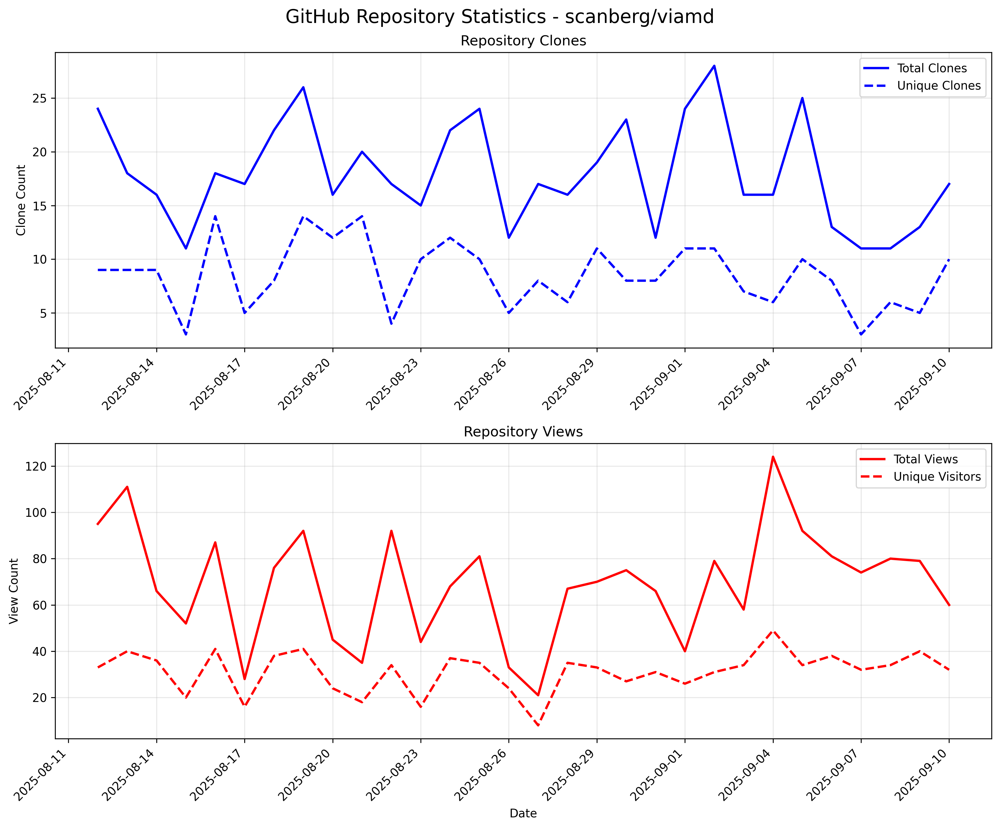

# get_stats
This repo is a python script to collect and store the statistics (traffic) of this repo: scanberg/viamd/
Collected information are: Daily number of clones, daily unique clones, daily page viewed and daily unique visitors.
Data are scraped everyday and the one for the day before is added to the database. Finally, the plot is showed in the readme.

## Setup and Usage

### Local Development
1. Install dependencies: `pip install -r requirements.txt`
2. Set GitHub token: `export GITHUB_TOKEN=your_token_here`
3. Run the complete workflow: `python run_stats.py`
4. For testing with sample data: `python generate_sample_data.py`

### GitHub Actions Automation
The repository includes a GitHub Actions workflow that runs daily at 06:00 UTC to automatically update statistics.

**Required Setup:**
- For collecting stats from external repositories (like `scanberg/viamd`), create a repository secret named `STATS_TOKEN` with a Personal Access Token that has read access to the target repository
- If collecting stats from the same repository, the default `GITHUB_TOKEN` will work

**Manual Trigger:**
- The workflow can be manually triggered from the Actions tab in GitHub

## Files
- `get_stats.py` - Main statistics collection script
- `run_stats.py` - Complete workflow (collect stats → generate plot → update README)
- `update_readme.py` - README update utility
- `generate_sample_data.py` - Sample data generator for testing
- `.github/workflows/update-stats.yml` - GitHub Actions workflow for daily automation

## Automation
This repository is configured to automatically update statistics daily via GitHub Actions. The workflow:
- Runs every day at 06:00 UTC
- Collects traffic statistics from the GitHub API
- Generates updated plots
- Commits changes back to the repository
- Can be manually triggered if needed

## Latest Statistics

*Last updated: 2025-09-11 06:11:56 UTC*

The plot above shows the daily traffic statistics for the scanberg/viamd repository, including:
- Total and unique clone counts
- Total page views and unique visitors

Data is collected daily using the GitHub API and stored in a local SQLite database.
